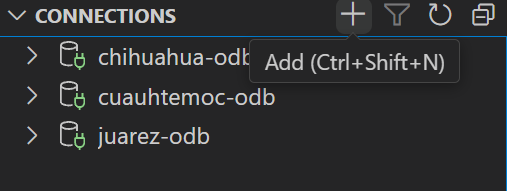
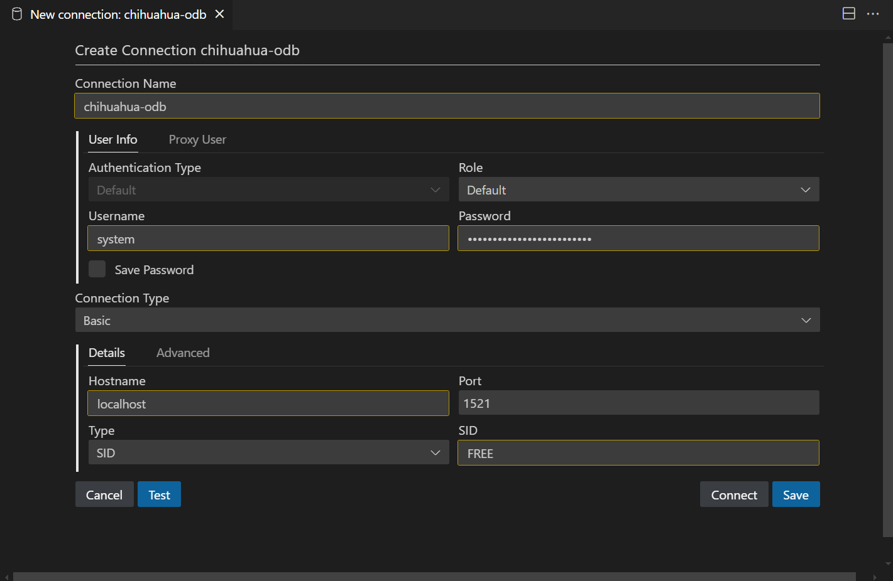
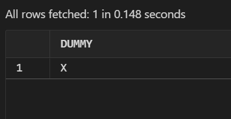

# Oracle Database. Conexión Básica con Database Links 

Proyecto básico para la conexión de instancias de Oracle Database Free [ejecutadas en
contenedores de docker] mediante el uso de **Database Links**.

### Descripción.

El proyecto supone un negocio de manzanas que posee distintas huertas en distintas localidades. Los servidores de bases de datos se ubican en Chihuahua, Juárez y Cuauhtemoc.

Chihuahua es el servidor principal.

### Prerequisitos
- Docker
- Necesitas un archivo `.env` en la ruta del repositorio con las siguientes variables.
  Tu asignas tus propios valores.
  ```sh
  # Password del usuario system de la base de datos a crear
  ORACLE_PWD=este_es_el_password_UwU
  ```

### 1. Crear red

```sh
docker network create apples-network
```

#### 2. Descargar imagen
```sh
docker pull container-registry.oracle.com/database/free:latest
```
### 3. Crear contenedores

```sh
docker stop chihuahua-odb
docker rm chihuahua-odb
docker run -dti --name chihuahua-odb \
--network apples-network \
-p 1521:1521 \
--env-file .env \
container-registry.oracle.com/database/free:latest

docker stop juarez-odb
docker rm juarez-odb
docker run -dti --name juarez-odb \
--network apples-network \
-p 1522:1521 \
--env-file .env \
container-registry.oracle.com/database/free:latest

docker stop cuauhtemoc-odb
docker rm cuauhtemoc-odb
docker run -dti --name cuauhtemoc-odb \
--network apples-network \
-p 1523:1521 \
--env-file .env \
container-registry.oracle.com/database/free:latest
```

### 4. Obtener IP Address de los contenedores

Al ejecutar

```sh
docker network inspect apples-network
```

Se obtiene la respuesta de la red con las ips que asignó a sus contenedores.

```json
[
    {
        "Name": "apples-network",
        // ...
        "Containers": {
            "08aa916f6875b8648c356920e379b474dc0dd1c9223c9e84dade40136af9f5e5": {
                "Name": "cuauhtemoc-odb",
                // ...
                "IPv4Address": "172.18.0.4/16",
                // ...
            },
            "13423dc197004e5c324f0c389cf547725ec3429b5d067cfea2bdaeb1708d87ff": {
                "Name": "juarez-odb",
                // ...
                "IPv4Address": "172.18.0.3/16",
                // ...
            },
            "6f9ef00a1d1e47170a793b4c9bb4f0d8917919ea4d4bfe0298da2d750088e82b": {
                "Name": "chihuahua-odb",
                // ...
                "IPv4Address": "172.18.0.2/16",
                // ...
            }
        },
        // ...
    }
]
```

Estas IPs nos ayudarán en seguida para crear los database links.

### 5. Conexiones desde un cliente de bases de datos

> [!TIP]
> Puedes usar `sqlplus` desde la consola del contenedor si así deseas.
> Para ejecutarlo deberás hacer lo siguiente:
> `docker exec -ti chihuahua sh`
> Dentro de la consola del contenedor puedes ejecutar:
> `sqlplus`
> Ahora puedes ejecutar cualquier sentencia de sql.

Necesitas un cliente para visualizar los datos de la oracle database.

En este caso se utilizó la [Oracle SQL Developer Extension for VSCode](https://marketplace.visualstudio.com/items?itemName=Oracle.sql-developer).

Seleccionas el ícono de la extensión:


Una conexión se realizaría de la siguiente manera:


Llenas los datos, recordando cambiar el nombre de la conexión y el puerto del contenedor.


Y listo, ya puedes usarlo como un cliente de sql. Recuerda crear una conexión para
cada contenedor.

### 6. Crear database links

> [!IMPORTANT]
> Los scripts aquí mencionados están en la carpeta [scripts](./scripts/).
> Son todos aquellos con la terminación *-db-links.sql

Para conectar `chihuahua-odb` a las otras bases de datos, ejecuta el script `chihuahua-db-links.sql` o:
```sql
drop database link if exists chihuahua_juarez;
create database link chihuahua_juarez
   connect to system identified by my_pw_is_very_safe_yipi_1
using '(DESCRIPTION =
         (ADDRESS=
            (PROTOCOL = TCP)
            (HOST = 172.18.0.3)
            (PORT = 1521)
         )
         (CONNECT_DATA =
            (SERVICE_NAME = FREE)
         )
      )';
select *
  from dual@chihuahua_juarez;


drop database link if exists chihuahua_cuauhtemoc;
create database link chihuahua_cuauhtemoc
   connect to system identified by my_pw_is_very_safe_yipi_1
using '(DESCRIPTION =
         (ADDRESS=
            (PROTOCOL = TCP)
            (HOST = 172.18.0.4)
            (PORT = 1521)
         )
         (CONNECT_DATA =
            (SERVICE_NAME = FREE)
         )
      )';
select *
  from dual@chihuahua_cuauhtemoc;
```

Si el último resultado regresa lo siguiente:


Significa que funcionó.

### 7. Crear tablas de prueba

> [!IMPORTANT]
> Los scripts aquí mencionados están en la carpeta [scripts](./scripts/).
> Son todos aquellos con la terminación *-init.sql

Ejecuta los scripts de creación de tablas para cada una de las conexiones según correspondan.

### 8. Insertar datos de prueba

> [!IMPORTANT]
> Los scripts aquí mencionados están en la carpeta [scripts](./scripts/).
> Son todos aquellos con la terminación *-insert.sql

Ejecuta los scripts de inserción de datos para cada una de las conexiones según correspondan.

### 9. Probar funcionamiento de las conexiones

Si seguíste los pasos explicados en este tutorial hasta este punto, ya podrás obtendrer los datos de los demás contenedores, desde la base de datos de la conexión actual.

Ejecutando esto desde `chihuahua-odb`:

```sql
SELECT * FROM apple_orchard_sales
UNION
SELECT * FROM apple_orchard_sales@chihuahua_juarez
UNION
SELECT * FROM apple_orchard_sales@chihuahua_cuauhtemoc;
```

Obtenemos las datos combinados de los 3 contenedores.

### Otra documentación

- Descargar imagen de Oracle Database Free [https://www.oracle.com/database/free/get-started/](https://www.oracle.com/database/free/get-started/)
- Parámetros del contenedor [https://github.com/oracle/docker-images/tree/main/OracleDatabase/SingleInstance#how-to-build-and-run](https://github.com/oracle/docker-images/tree/main/OracleDatabase/SingleInstance#how-to-build-and-run)

### [Licencia (GNU General Public License)](./license.md)

### Autoría
Adora González. [@stariluz](https://github.com/stariluz)